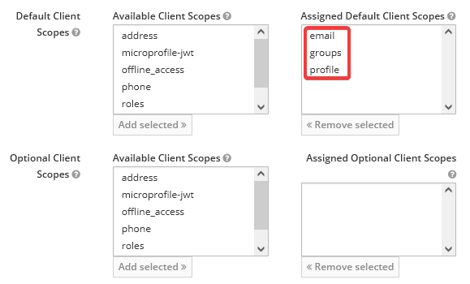

---
tags:
  - DevOps Cookbook
---
# Traefik ForwardAuth Support with Keycloak

:::info
Original blog post over on
[BrianTurchyn.net](https://brianturchyn.net/traefik-forwardauth-support-with-keycloak/)
:::

## Prerequisites

- Traefik >= v2 installed and running in Docker
- Identity Provider set up such as Keycloak

## Steps

### Required Information

- A signing secret for the ForwardAuth container. This can be any random string.
- The realm provider URI. This URI will have `/.well-known/openid-configuration`
  appended to it to retrieve the OIDC configuration from your identity
  provider, so be sure to have this available.
- Realm Client ID (this will be created below)
- Realm Client Secret (this will be created below)
- Traefik’s Docker network name (assuming traefik-webgateway for this guide)
- Traefik’s entry point that you’re using (assuming websecure for this guide)

### Get your realm provider URI

Assuming you are using Keycloak, you should be able to use the following steps:

1. Open the admin console for Keycloak, and select the realm you are using
2. Select "Realm Settings". In the Endpoints section, there should be "OpenID
   Endpoint Configuration". Copy this link. Remove the
   `/.well-known/openid-configuration` part of the path (there should be no `/`
   at the end of the URL. This is important!

### Assign valid redirect URIs in the identity provider

Assuming you are using Keycloak, you should be able to use the following steps:

1. Open the admin console for Keycloak, and select the realm you are using
2. Select "Clients", then click "Create"
3. Create your Client ID. All other values can remain their defaults. Click
   "Save". This is your client ID, required below.
4. In the "Settings" section, change the following values, then click "Save":
   - Access Type: `confidential`
   - Valid Redirect URIs: Add each domain you want to authenticate against with
     `/_oauth` set as the path (example: `https://example.com/_oauth`)
5. Navigate to the "Credentials" tab. Get the value in the "Secret" field.
   This is your client secret, required below.

### Assign client scopes to your client

The ForwardAuth container requires, at minimum, these client scopes to be
assigned: `email`, `groups`, and `profile`. It's possible you may need more or
less depending on your configuration. (Is yours different? Let me know in the
[GitHub Issues](https://github.com/b-turchyn/wiki/issues) or the [blog
comments](https://brianturchyn.net/traefik-forwardauth-support-with-keycloak/)
so I can keep this up-to-date!)

1. Open the admin console for Keycloak, and select the realm you are using
2. Select "Clients", then select the client you created above
3. In the "Realm Scopes" section, select each of the scopes above from the list
   of available scopes, then click "Add Selected" (note: depending on your
   configuration, those scopes could be either in the "Default Client Scopes"
   or "Optional Client Scopes" section).



### Set up ForwardAuth container

For ForwardAuth to work, you need a container that will handle the auth
forwarding for you. The current recommended one for a generic OIDC provider is
[mesosphere/traefik-forward-auth](https://hub.docker.com/r/mesosphere/traefik-forward-auth)
which is a fork of an older version that does not support generic OIDC.

It’s generally easiest to run this in the same docker-compose.yaml file as your
Traefik install. This is the assumption with the rest of this guide.

#### Create a new container definition

```yaml
  forwardauth:
    image: mesosphere/traefik-forward-auth
    networks:
      - webgateway
    environment:
      - SECRET=<signing-secret>
      - PROVIDER_URI=https://<your-domain>/auth/realms/btdev
      - CLIENT_ID=<client-id>
      - CLIENT_SECRET=<client-secret>
    labels:
      - "traefik.enable=true"
      - "traefik.docker.network=traefik_webgateway"
      - "traefik.http.services.forwardauth.loadbalancer.server.port=4181"
      - "traefik.http.routers.forwardauth.entrypoints=websecure"
      - "traefik.http.routers.forwardauth.rule=Path(`/_oauth`)"
      - "traefik.http.routers.forwardauth.middlewares=traefik-forward-auth"
      - "traefik.http.middlewares.traefik-forward-auth.forwardauth.address=http://forwardauth:4181"
      - "traefik.http.middlewares.traefik-forward-auth.forwardauth.authResponseHeaders=X-Forwarded-User"
      - "traefik.http.middlewares.traefik-forward-auth.forwardauth.trustForwardHeader=true"
```

This does a few things:

1. Creates the ForwardAuth container with the needed configuration (via
   `environment` variables), defined as `forwardauth` in the router
   configuration
2. Announces the container to Traefik and makes it accessible via any domain
   via the `/_oauth` path
3. Defines a new middleware called `traefik-forward-auth` which will be used by
   other containers to route authentication requests through

You can also add the following labels if you are using SSL and are using a
certresolver. In this case, it is labelled as `cloudflare` in the Traefik
configuration. Replace with the certresolver name that you are using.

```yaml
- "traefik.http.routers.traefik-forward-auth.tls=true"
- "traefik.http.routers.traefik-forward-auth.tls.certresolver=cloudflare"
```

### Assign Middleware To Other Containers

For any container behind Traefik that you want to have protected by OIDC, add
the following labels to it, then re-deploy that container:

```yaml
- "traefik.http.routers.traefik-forward-auth.middlewares=traefik-forward-auth"
```

## Debugging

### Getting Extra Information
Set the `LOG_LEVEL` environment variable to `debug` or `trace` for additional
log information, and then re-deploy your container.

### Bad Gateway Error
You may receive an error where the error message "Bad Gateway" is displayed.
This is likely accompanied by the URL having changed and having an error in it
that mentions invalid scopes:

```
https://[example.com]/_oauth?error=invalid_scope&
error_description=Invalid+scopes%3A+openid+profile+email+groups&state=[...]
```

To fix this, assign the client scopes defined in the error description in the
URL, then try again. See the section "Assign client scopes for your client"
above.

## Changelog
- 2021-08-01: Published.
- 2022-01-16: Added section on assigning client scopes, based on provided
  feedback from [@pbitante](https://github.com/pbitante) and
  [@PierrePetit](https://github.com/PierrePetit) in the blog comments.
