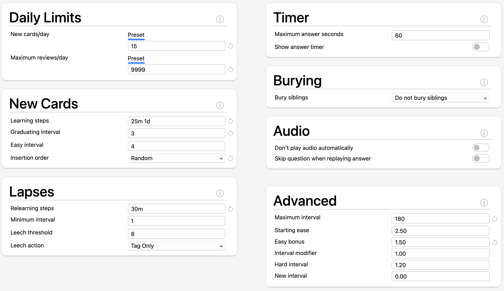

# Anki

My go-to flashcard app for [spaced repetition](learning/spaced-repetition.md)
learning.

Anki has [shared decks](https://ankiweb.net/shared/decks/) for lots of different
subjects that the community has contributed. Some that I use:

- [Ultimate Geography](https://ankiweb.net/shared/info/2109889812) tests the
  names of countries / sovereign states, their capitals, islands, flags, and
  bodies of water, including their location on the map. Very good.
- [Japanese Basic Hiragana](https://ankiweb.net/shared/info/2183294427) shows
  the Japanese character and you need to provide the English equivalent
  pronunciation.
  - The author has created a more comprehensive
    [Japanese Hiragana](https://ankiweb.net/shared/info/195754716) deck with the
    full set of Hiragana characters

## Configuration Changes

Here's my Anki configuration. There are a number of key changes from the default
values, based on
[this YouTube video](https://www.youtube.com/watch?v=Eo1HbXEiJxo)

