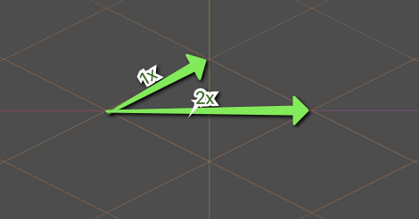

# Creating Isometric Games

Isometric games are games where the graphics emulate
[isometric projection](https://en.wikipedia.org/wiki/Isometric_projection).
Because the camera orientation doesn't change, the graphics are still
technically 2D, but it's common to refer to this as 2.5D to suggest that there's
some depth to the display.

Because we're still working in two dimensions, we need to constantly account for
this isometric viewpoint in all of our code and node configuration.

Everything here assumes that you are starting from zero knowledge, just as I did
when I first started learning about this. The difference between tutorials on
the subject and this page though is we're starting with the required background
knowledge in order to properly understand not only what we need to do, but why
we're doing it.

## Background Theory

We consider the graphics to be isometric if the grid lines we use could have
been created using a [linear transformation](#linear-transformations). There's
more information below, but if your grid lines are still parallel to each other,
you've done a linear transformation.

We're going to be doing vector and matrix multiplication in order to work in
this environment. Godot makes this pretty easy.

### Common Ratios

It's common to use a 2:1 ratio on cartesian coordinates to achieve the isometric
look. This means that, to move on a grid, you move 2 pixels on the `x`
coordinate for every 1 pixel on the `y` coordinate.

This whole article will assume that we're working with that 2:1 ratio.

If we held a standard 2D grid in our hands, what would we do to it to get to the
isometric layout? We would take the grid, turn it 45 degrees, and then squish
down on the new vertical axis. That's fine, but how do we explain this to a
computer?

We need to use linear transformations.

### Linear Transformations

Brilliant.org provides
[a good definition of linear transformations on their wiki](https://brilliant.org/wiki/linear-transformations/):

> A **linear transformation** is a function from one vector space to another
> that respects the underlying (linear) structure of each vector space.

For a nice primer on linear transformations, watch
[this video by 3Blue1Brown](https://www.youtube.com/watch?v=kYB8IZa5AuE). Yes,
it's a video about math. No, you shouldn't skip it. If you want to make video
games, you need to know how this stuff works.

## Tileset and Tilemap creation

## Translating Between Cartesian and Isometric Coordinates
