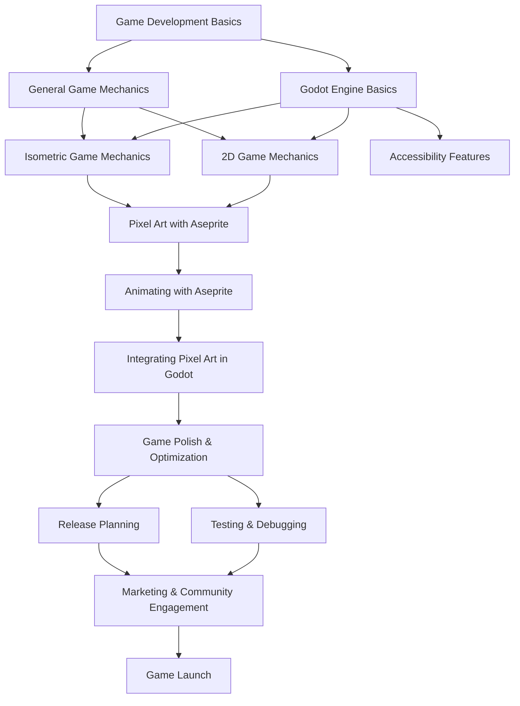

# Game Development

I'm a big fan of video games. To me, games are interactive art. Understanding
the internal mechanics of how games work makes me appreciate them more.

## Game Engines

### JavaScript

- [photonstorm/phaser](https://github.com/photonstorm/phaser)

### Unreal Engine

When users experience flickering in the UE4 or UE5 editor, this seems to be
traced back to an issue with Nvidia's overlay test mode.
[Applying a registry fix can correct this](https://forums.unrealengine.com/t/editor-window-and-menu-flickering-and-glitching/552308/6):

```
Windows Registry Editor Version 5.00

[HKEY_LOCAL_MACHINE\SOFTWARE\Microsoft\Windows\Dwm]
"OverlayTestMode"=dword:00000005
```

## Resources

- [Game Programming Patterns](https://gameprogrammingpatterns.com/)
- [How to Make a Roguelike](https://www.gamedeveloper.com/design/how-to-make-a-roguelike) ([archive](https://archive.ph/CTukV))
- [Game Jam Theme Generator](https://letsmakeagame.net/game-jam-theme-generator/) Some interesting ones I've generated: 
	- Nothing Is Permanent
	- Going Deeper
	- Parallel Dimensions
	- You Are Your Own Enemy
	- Stuck In A Loop
	- The Environment Changes You

Procedural generation:

- [How to code your own procedural dungeon map generator using the Random Walk Algorithm](https://www.freecodecamp.org/news/how-to-make-your-own-procedural-dungeon-map-generator-using-the-random-walk-algorithm-e0085c8aa9a/)
  - [Random walker algorithm](https://en.wikipedia.org/wiki/Random_walker_algorithm),
    Wikipedia
    - I don't understand a lot of the math behind this algorithm yet. I have
      more reading to do here.

Creating game assets:

- [Creating Isometric RPG Game Backgrounds](https://talesofsyn.com/posts/creating-isometric-rpg-game-backgrounds)
  ([HN](https://news.ycombinator.com/item?id=34989407))

### Shaders

- [Shadertoy](https://www.shadertoy.com/)

### Visual Assets

- [ambientCG](https://ambientcg.com/) - public domain assets, materials, HDRIs,
  SBSARs, and models
- [Game-icons.net](https://game-icons.net/)
- [Polyhaven](https://polyhaven.com/)
- [Share Textures](https://www.sharetextures.com/)

## Learning Plan


