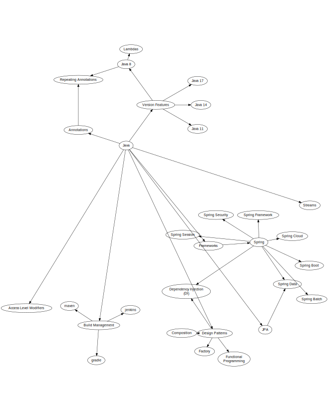

---
tags:
  - Language
  - Java
---
# Java

- [Baeldung](https://www.baeldung.com) continues to be one of the best online
  resources for Java and Spring developers. Their content is very well written.

I am working on a tech tree to cover several popular, valuable concepts that I
feel Java developers should know. This is a work-in-progress. Clicking on the
image below will take you to the Graphviz source.

[](https://r.btdev.org/java-tech-tree)

## Libraries

- [Jackson](/programming/libraries/jackson.md)

## JPA

JPA is Java's built-in persistence mapper. It's all annotation-driven.

- [Java Persistence book](https://en.m.wikibooks.org/wiki/Java_Persistence)

## Mocking

Mockito is my preferred mocking library. It does support static mocking when
required, although static code is a code smell and a sign something should be
refactored.

_See: [Mocking Static Methods With
Mockito](https://www.baeldung.com/mockito-mock-static-methods), Baeldung_

Example:
```java
// The static mock is scoped within the try statement. Neat!
try (MockedStatic<MyClass> myClass = mockStatic(MyClass.class)) {
  myClass.when(MyClass::performOperation).thenReturn("foo");
  myClass.when(() -> MyClass.withArguments("foo")).thenReturn("bar");
}
```

### One-to-One Mappings

Assume the following structure. The `COMPANY` table is the owner of the data.

<!-- This needs to stay on the same line, otherwise Docusaurus whines...smh -->


The entities would look like this:

```java
@Entity
public class Company {
  private Long id;

  private String name;

  @OneToOne(mappedBy = "company")
  private CompanyAddress address;
}

@Entity
public class CompanyAddress {
  private Long id;

  @OneToOne
  @JoinColumn(name = "company_id", referencedColumnName = "id")
  private Company company;

  private String street;
}
```


## Spring

- [Custom MVC
  Validations](https://www.baeldung.com/spring-mvc-custom-validator), Baeldung
- [Swagger 2 with Spring REST
  API](https://www.baeldung.com/swagger-2-documentation-for-spring-rest-api),
  Baeldung
